# Clonmel Pride Webpage

---

## Live site available to view [here](https://james-fitz.github.io/clonmel-pride/)

---

## Introduction
Having spoken with the Chairperson of Clonmel Pride, we have decided that there is a definitive need for a website which displays and organises all of the Clonmel Pride information in one easy to use hub.
This site will allow users to navigate the site easily and intuitively using the navigation bar at the top of all pages, see upcoming events in a slideshow of posters and a summary of each day located below the poster slideshow, view a gallery containing images from current and previous Pride events, donate to the Pride organization through an external link to the festivals gofundme page, and contact the Pride committee directly through a contact form.

---

## Features

### Existing Features

#### Navigation Bar

-   Featured on all three pages, the fullly responsive navigation bar includes links to the “Home” page, “Gallery” page, donation section of the "Home" page, and a “Contact Us” page. This navigation bar is identical across all three pages, and fully responsive to screen size.
-   There is a logo in the top left corner of all pages which will link back to the “Home” page.
-   This section will allow the user to easily navigate from page to page across all devices without having to revert back to the previous page via the ‘back’ button.

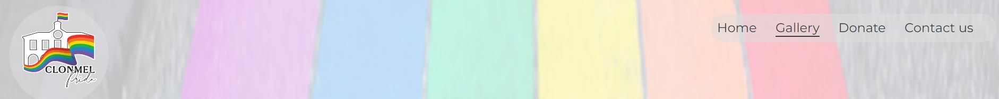

#### Landing Page
-   The landing page consists of an image from Clonmel pride 2022, giving the user a visual representation of what to expect from the website.

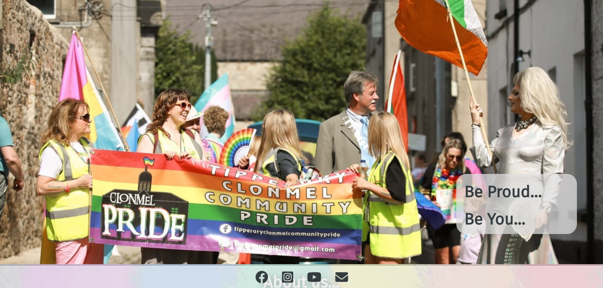

#### About us section
-   The about us section contains some key information about the inception of Clonmel Pride and a basic overview of the values and goals of the Clonmel Pride team.

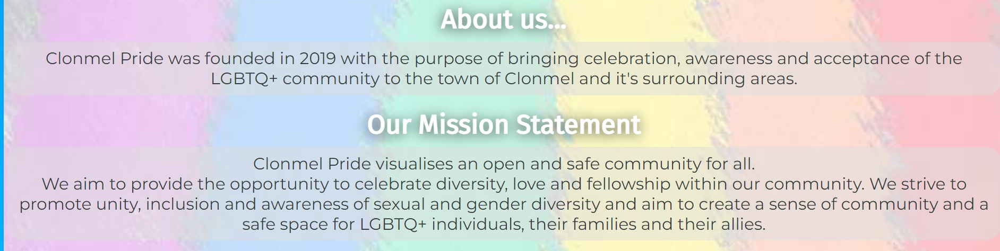

#### Upcoming events  section

-	This section will allow the user to see exactly what events will be happening for the Clonmel Pride festival. We will have a slideshow of posters which will give the user all of the information for the specific pride events.
-	This section will also contain a summary of daily events separated into each day underneath the posters to give users an overview and outline of all events.

Event poster slideshow
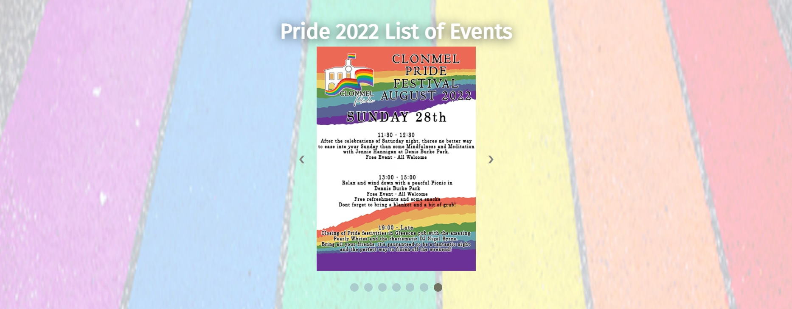

Event details by day
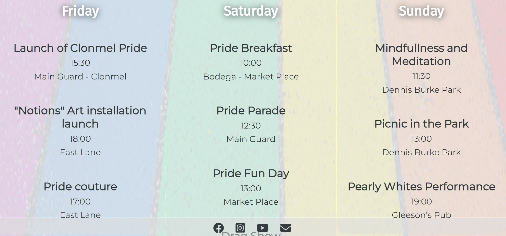

#### The Donate Section

- This section provides an external link through the gofundme logo to the Clonmel Pride donation page to allow users to donate to the festival.

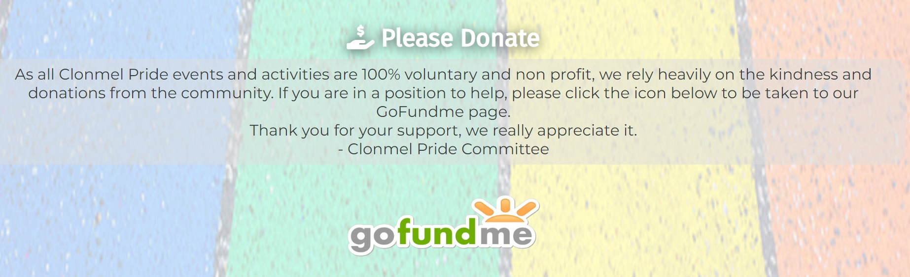

#### The Footer

-	The footer section includes links to the relevant social media sites for Clonmel Pride. The links will open to a new tab to allow easy navigation for the user.
-	The footer is valuable to the user as it encourages them to keep connected via social media.
-   The footer is fixed to the bottom of the page to always allow the user quick access to social media links.

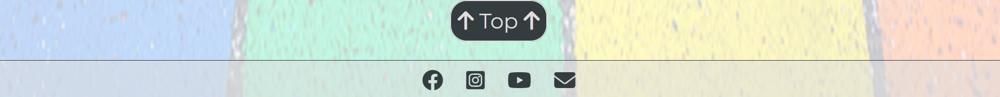

#### Gallery Page

-	The gallery provides the user with images from previous Pride events.
-	This section is valuable to the user as they are able to easily identify the types of events the organisation puts together and determine if it is something that interests them.

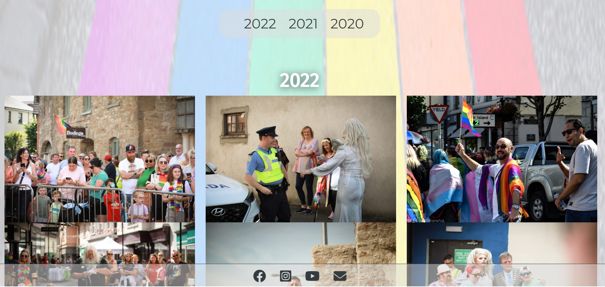
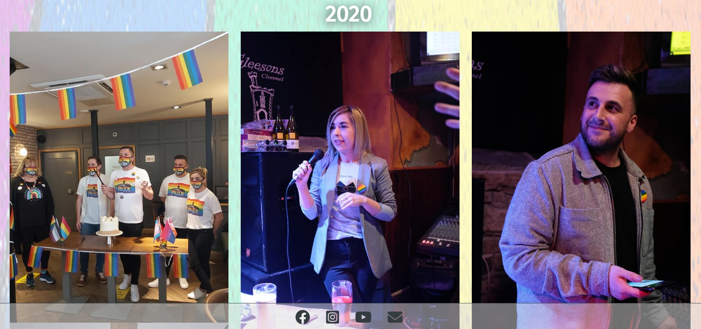

#### The Contact Us Page

-	This page allows the user to get in touch with the pride team. The user will be able to specify if they would like to receive more information, get involved, get support, volunteer, host an event or sponsor an event. The user is required to submit their full name, email address and a message to the pride team.

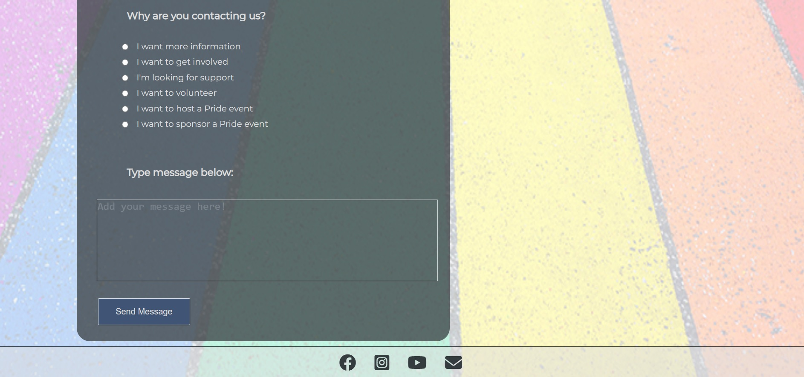

- Once the user has filled in the form and submitted all the required information, they will be taken to a thank you page. After 5 seconds on this page, they will be redirected automatically to the home page.

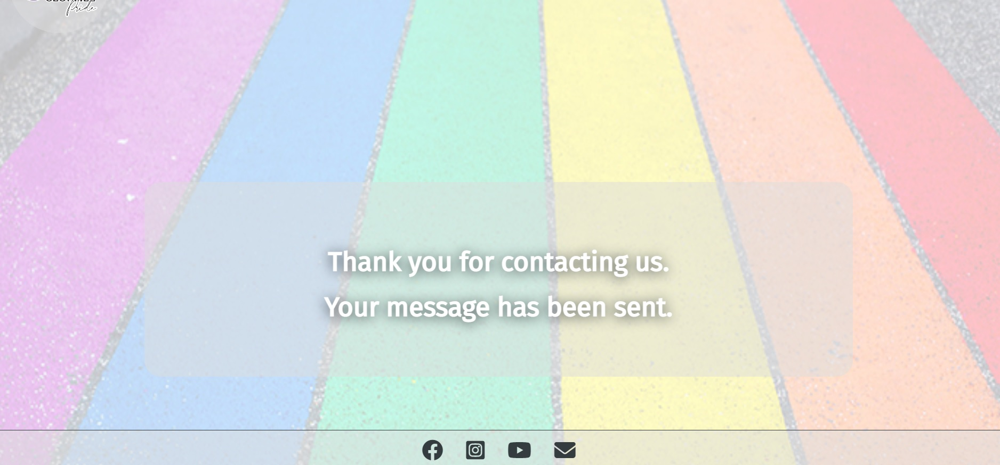

### Future features that may be implemented
-	A larger gallery area which includes more pictures can be added at a future date, possibly adding separate pages for each year.
-	Implementation of a form to allow users to book events through the webpage using Eventbrite.
-	A section to livestream future Pride events that would be viewable by users.

---

## Testing

### Lighthouse test results

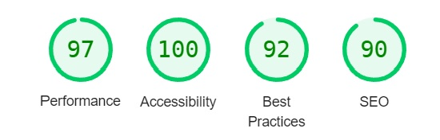

Testing of this webpage has been ongoing during the project.
The webpage was deployed half way through the completion of the project to ensure an appropriate amount of testing could be completed.

The website was tested fully on the following browsers: 
-   __Google chrome__
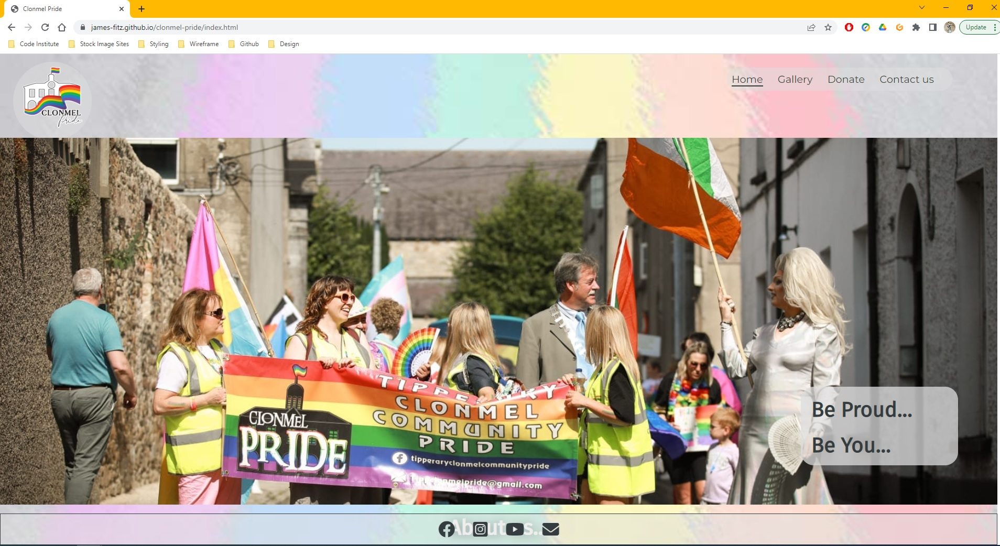	
-   __Mozzilla Firefox__
	
-   __Brave__	
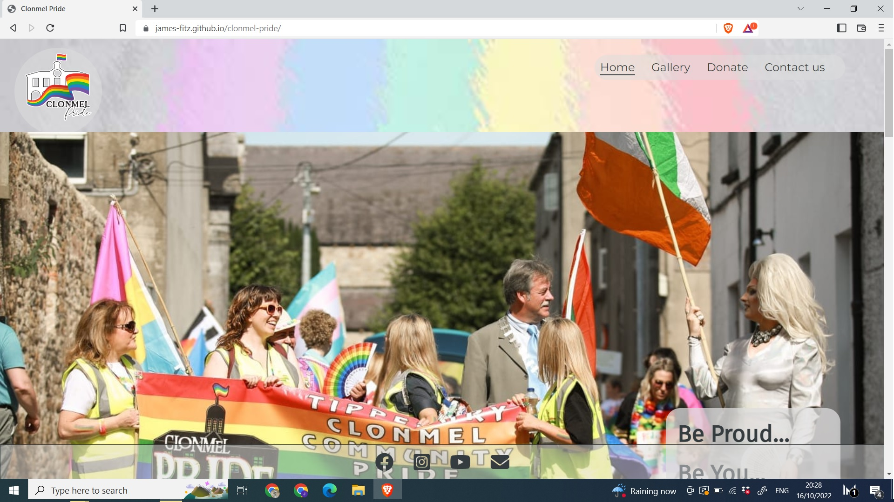
-   __Safari__	

-   __Android mobile__	
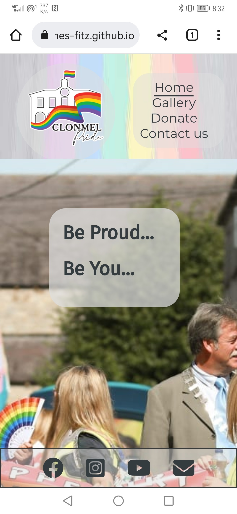 
-   __IOS mobile__
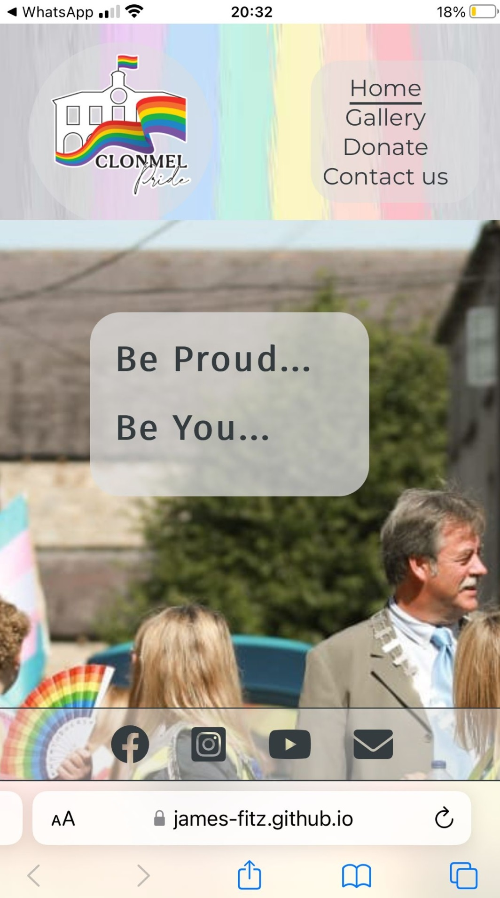 

---

-   All of the elements loaded correctly in an appropriate timeframe.
-   The webpage is responsive on all devices and different screen sizes to as low as 320px screen width.
-   All features worked as intended on all platforms. 
-   The navigation bar at the top of the page linked to all of the correct pages and sections. 
-   The logo loaded correctly and always linked back to the index.html page. The slideshow worked correctly on all platforms and screen sizes. 
-   The footer linked to all of the appropriate external areas on all platforms.  
-   The gallery page is viewable and correctly sized to ensure a pleasant user experience across all screen sizes. 
-   The “Donate” navigation element will link the user back to the index.html page and navigate to the donate section of the page. 
-   The form requires users to fill in all information and cannot be submitted without a first name, last name, email address, radio box selection and message. Once submitted, users are taken to a thank you page for 5 seconds and the redirected to the home page. This feature works on all devices and browsers. 

### Validator Testing

#### HTML
 -  No errors were returned when passing through the official W3C validator
#### CSS
 -  No errors were found when passing through the official (Jigsaw) validator

### Fixed Bugs

-   There was a white line on the right hand side of all pages. This was caused by the header being slightly lager than the background. Lowering header width fixed the issue.

### Unfixed Bugs
-   The donate navigation link at the top of the screen doesn't always navigate to the donate section while on mobile. It will always bring the user back to the index.html page but will sometimes not navigate to the donate section until the button is clicked again.

---

## Deployment

### Cloning/Forking

### Local Deployment

### Remote Deployment
This project was deployed using Github pages. The steps used to deploy the page are as follows:
-	In the GitHub repository, navigate to the Settings tab.
-	On the left hand side of the page, under “code and automation”, click on the “pages” section.
-	Select the “main” branch to deploy the page from.
-	Once the main branch has been selected, the page will be automatically refreshed with a detailed ribbon display to indicate the successful deployment.

## The live link can be found [here](https://james-fitz.github.io/clonmel-pride/)

---

## Credits

### Content
-	The text content on the home page was supplied by Clonmel Pride.
-	The code and styling for the slideshow on the index.html page was taken from [Section.io](https://www.section.io/engineering-education/how-to-make-an-image-carousel-for-your-website/) some small alterations were made to the styling.
-	The icons in the footer, contact page and donate section were taken from [Font Awesome](https://fontawesome.com/)
### Media
-	The logo was supplied by Clonmel Pride.
-	The poster images were supplied by Clonmel Pride.
-	Sponsor logos and gofundme logos were taken from their respective websites. 
-	The images in the gallery were provided by Clonmel Pride and Eric Brown.
-	Background rainbow image was taken from [Unsplash](https://unsplash.com/photos/VxKUQY3tLNs)

### Additional  Help
-	Mentor Chris Quinn advised implementation of a separate javascript file for the slideshow script.
-	Mentor also advised implementation of a separate “thank-you” page after submitting the contact form, and provided the code to refresh user back to index.html page.

